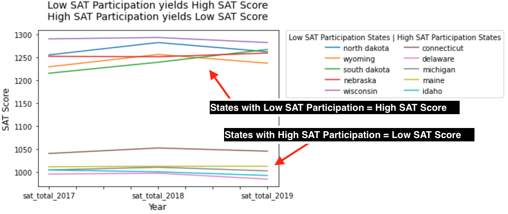
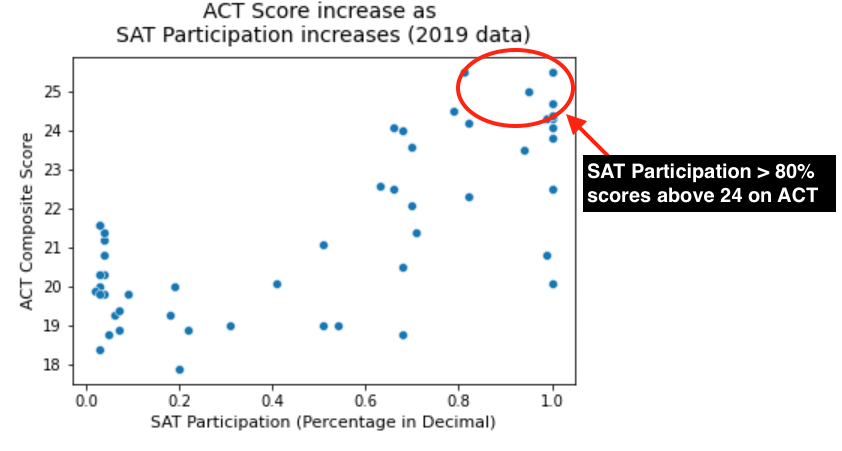
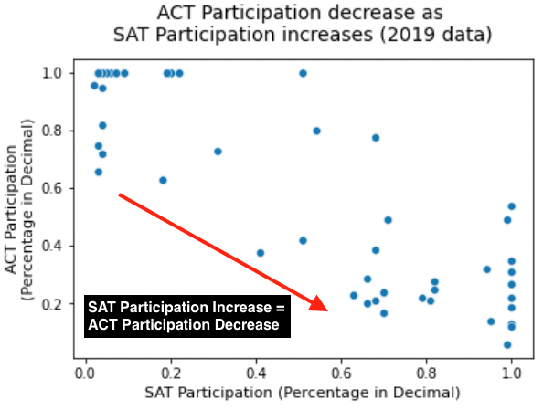

#  Project 1: Standardized Test Analysis

### Background

The SAT and ACT are standardized tests that many colleges and universities in the United States require for their admissions process. This score is used along with other materials such as grade point average (GPA) and essay responses to determine whether or not a potential student will be accepted to the university.

Colleges and universities accept both the SAT and ACT tests equally and do not have a preference of one test over the other ([*source*](https://www.princetonreview.com/college/sat-act)). Typically, the popularity of a test varies depending on the state and area in the country due to various reasons, which results in one test being more dominant than the other in some states.

In 2016, the College Board redesigned and released the new SAT test, changing the content, format and scoring ([*source*](https://sat.ivyglobal.com/new-vs-old)).

### Problem Statement

On March 2016, SAT was redesigned and was released with a new format. With varying legislative decisions, there have been changes in the participation rates within different states.
**This project aims to explore trends between the SAT and ACT participation rates and scores for years 2017-2019, seeking recommendations to improve SAT participation rates.**

### Data Dictionary

|Feature|Type|Dataset|Description|
|---|---|---|---|
|**state**|*string*|act_sat_17_18_19|The list of states in the country with ACT and SAT data| 
|**act_participation_2017**|*float*|act_sat_17_18_19|The percent of 2017 ACT participation rate in a state (units percent in decimal format to 2 decimal places, 0.64 means 64%)| 
|**act_participation_2018**|*float*|act_sat_17_18_19|The percent of 2018 ACT participation rate in a state (units percent in decimal format to 2 decimal places, 0.64 means 64%)| 
|**act_participation_2019**|*float*|act_sat_17_18_19|The percent of 2019 ACT participation rate in a state (units percent in decimal format to 2 decimal places, 0.64 means 64%)| 
|**sat_participation_2017**|*float*|act_sat_17_18_19|The percent of 2017 SAT participation rate in a state (units percent in decimal format to 2 decimal places, 0.64 means 64%)| 
|**sat_participation_2018**|*float*|act_sat_17_18_19|The percent of 2018 SAT participation rate in a state (units percent in decimal format to 2 decimal places, 0.64 means 64%)| 
|**sat_participation_2019**|*float*|act_sat_17_18_19|The percent of 2019 SAT participation rate in a state (units percent in decimal format to 2 decimal places, 0.64 means 64%)| 
|**act_composite_2017**|*float*|act_sat_17_18_19|The value of 2017 ACT composite score (average score of all subjects) in a state (no units, to 1 decimal place)| 
|**act_composite_2018**|*float*|act_sat_17_18_19|The value of 2018 ACT composite score (average score of all subjects) in a state (no units, to 1 decimal place)| 
|**act_composite_2019**|*float*|act_sat_17_18_19|The value of 2019 ACT composite score (average score of all subjects) in a state (no units, to 1 decimal place)| 
|**sat_total_2017**|*integer*|act_sat_17_18_19|The value of 2017 SAT total score in a state (no units)| 
|**sat_total_2018**|*integer*|act_sat_17_18_19|The value of 2018 SAT total score in a state (no units)| 
|**sat_total_2019**|*integer*|act_sat_17_18_19|The value of 2019 SAT total score in a state (no units)| 
|**sat_avg_participation**|*float*|act_sat_17_18_19|The percent of mean SAT participation rate from 2017-2019 in a state (units percent in decimal format to 2 decimal places, 0.64 means 64%)| 
|**sat_avg_total**|*float*|act_sat_17_18_19|The mean value of 2019 SAT total score from 2017-2019 in a state (no units, to 1 decimal place)| 
|**act_avg_participation**|*float*|act_sat_17_18_19|The percent of mean ACT participation rate from 2017-2019 in a state (units percent in decimal format to 2 decimal places, 0.64 means 64%)| 
|**act_avg_composite**|*float*|act_sat_17_18_19|The value of mean ACT composite score (average score of all subjects) from 2017-2019 in a state (no units, to 1 decimal place)| 

### Analysis Summary

By cleaning up and analysing the participation rate and scores data for ACT and SAT from 2017 to 2019, we find out the estimated average scores for SAT and ACT:
* SAT average score per state = 1100
* ACT average score per state = 21

These values were used to do data trend investigation.

The findings from analysing and comparing the data across 3 years are as follows:
1. States with higher SAT participation generally scores lower on the SAT test (with SAT Participation above 80%, the SAT score found was below the average of 1100)
    * *likely due to mandatory SAT testing which includes students who are not fully prepared and more likely to score lower*

2. States with higher SAT participation generally scores well on the ACT test (with SAT Participation above 80%, the ACT score found was above the average of 21)
    * *likely due to mandatory SAT testing, with only students fully prepared for ACT choosing to also take the ACT test and score well*

    
3. As SAT participation increases, the ACT participation decreases and vice versa
    * *likely due to mandatory SAT testing, so number of students who takes ACT will decrease as it is optional*

### Conclusions/Recommendations

Based on the results of the investigations, there are 3 recommendations for improving the SAT participation rates:
1. The College Board can focus on working to sign contracts with the Department of Education of states without mandatory SAT testing, especially if the state's current contract with ACT is expiring
2. Consider giving discounts or promotions to students taking the SAT tests as the tests can get costly especially if the student intends to apply to many colleges
3. Place more focus on states with low SAT scores and states with high ACT scores to provide support and increase confidence in SAT